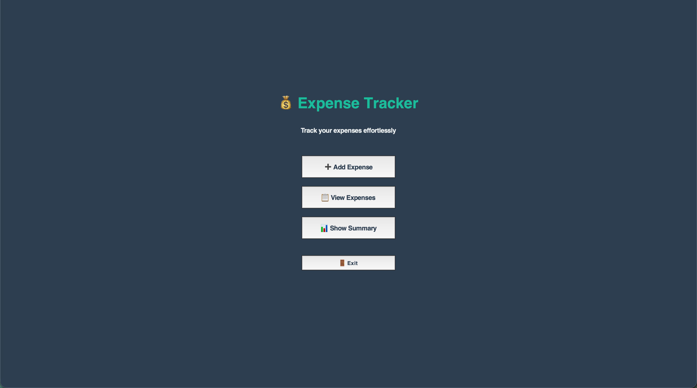
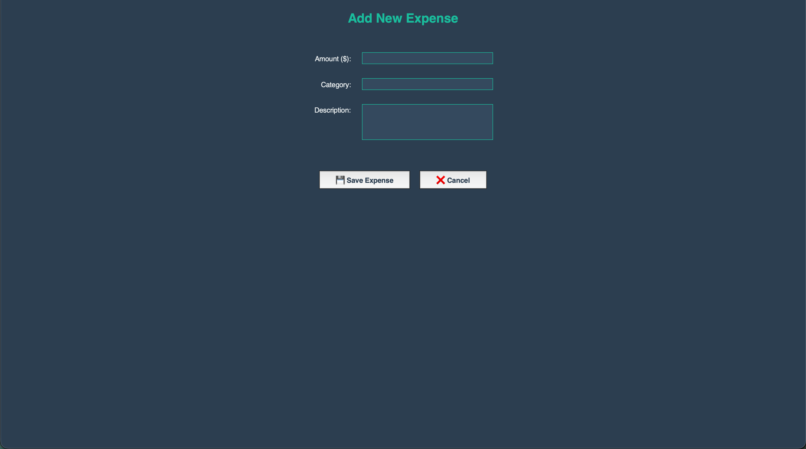
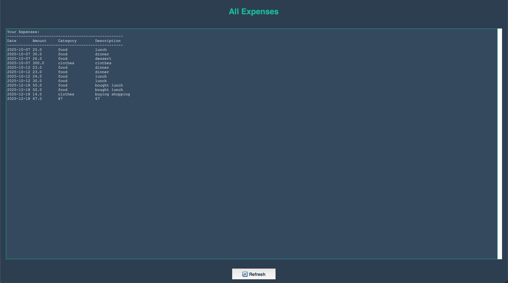
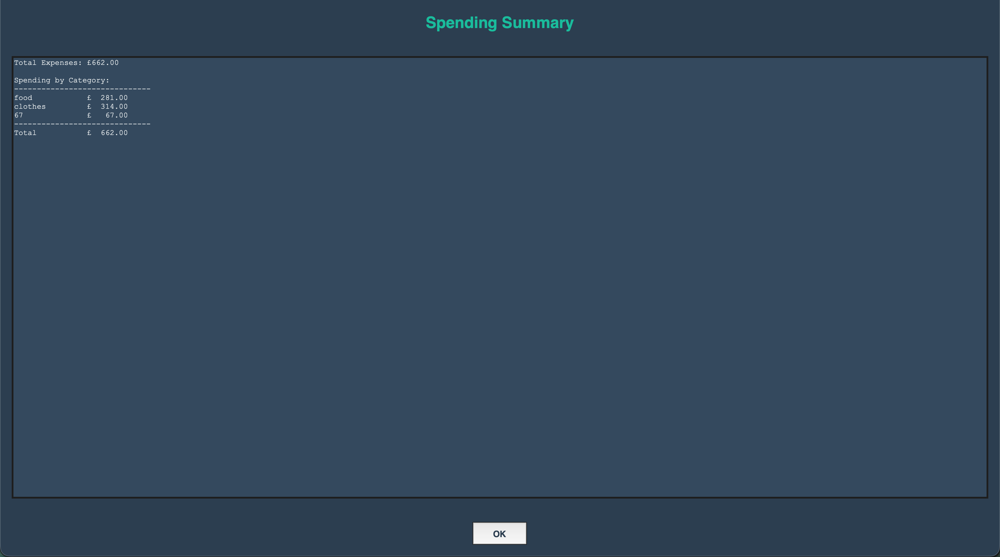

# 💰 Expense Tracker - Final Year Project

A professional expense tracking application built with Python and Tkinter, featuring both GUI and terminal interfaces.

## Features

**Modern GUI Interface**
- Clean, professional dark theme with accent colors
- Responsive design with fullscreen support
- Intuitive button layout with hover effects
- Real-time validation and error handling

**Core Functionality**
- **Add Expenses**: Record spending with amount, category, and description
- **View All Expenses**: Scrollable table display with formatted columns
- **Spending Summary**: Category breakdown with total calculations
- **Data Persistence**: Automatic CSV storage with backup

**Technical Highlights**
- Dual interface support (GUI + Terminal)
- Object-oriented design with separation of concerns
- Comprehensive error handling
- Professional UI/UX design principles

Screenshots

### Main Menu


### Add Expense Window


### View Expenses Window  


### Spending Summary


*(Note: Add actual screenshots to a `screenshots/` folder)*

## 🚀 Quick Start

### Prerequisites
- Python 3.6 or higher
- Tkinter (comes pre-installed with Python)

### Installation
```bash
# Clone the repository
git clone https://github.com/Dhruvesh44/Expenses_Project.git
cd expense-tracker

# Run the GUI application
python3 gui.py

# Alternatively, run the terminal version
python3 main.py
